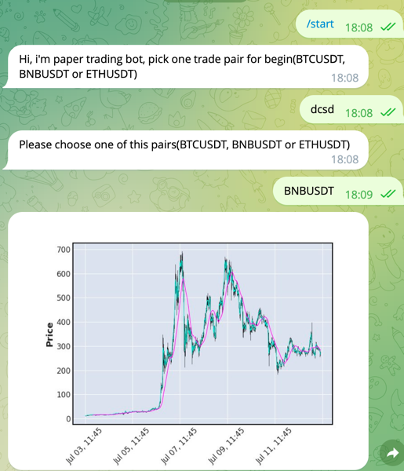

# TgBot
TgBot which integrated with site https://paper-trader.frwd.one/
Choose one trade pair and get picture with results

## Instalation
    git clone https://github.com/wQuelS/py-TGbot.git
    python -m venv venv
    activate venv:
    * venv\Scripts\activate (for windows)
    * source venv/bin/activate (for MacOS/Linux)
    pip install -r requirements.txt
    Insert your TG Bot API key:
     * set BOT_TOKEN = "Your key" (for windows)
     * export BOT_TOKEN = "Your key" (for MacOS/Linux)
## Run
python bot.py

## Demo

